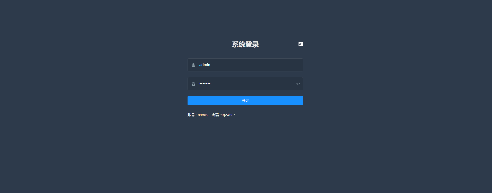
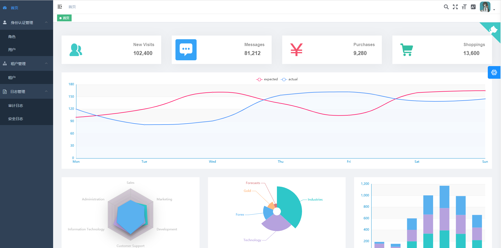
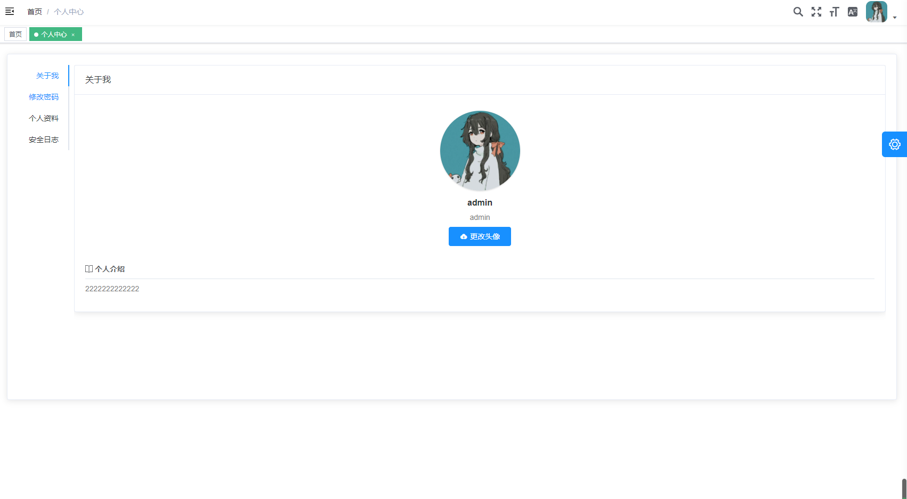
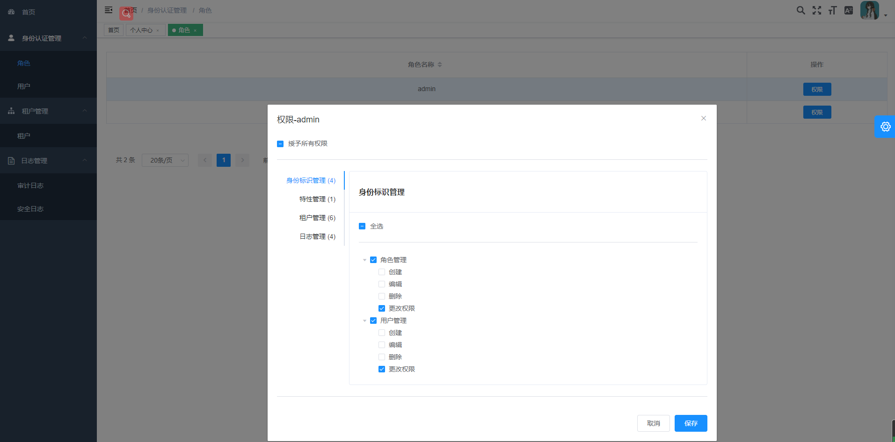
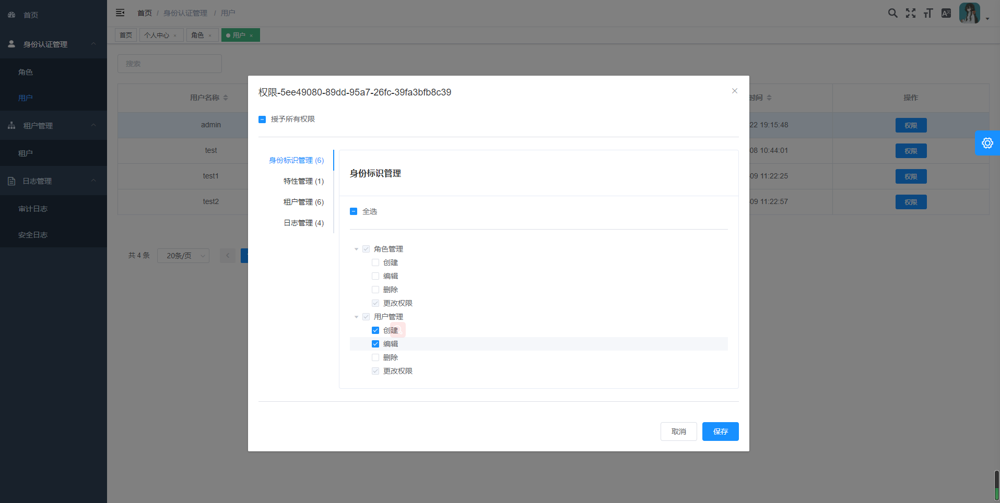
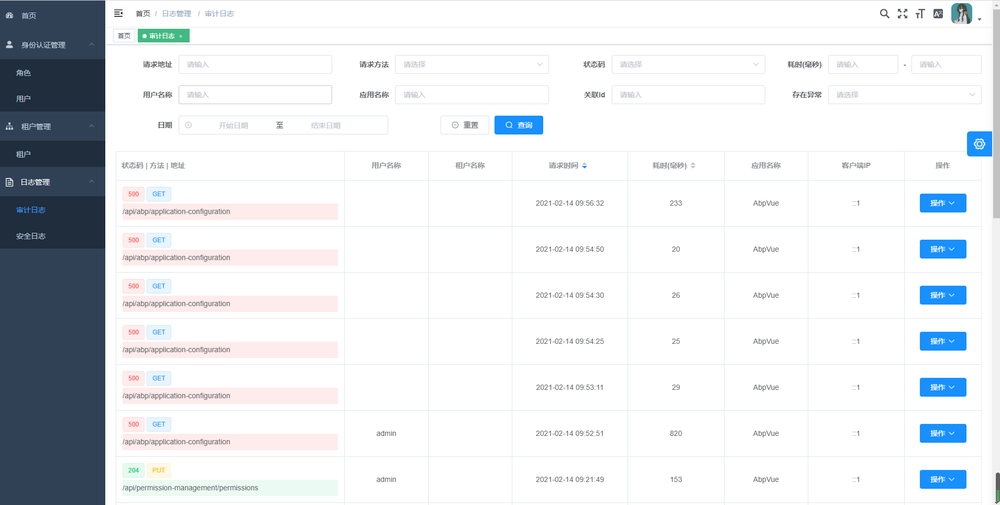
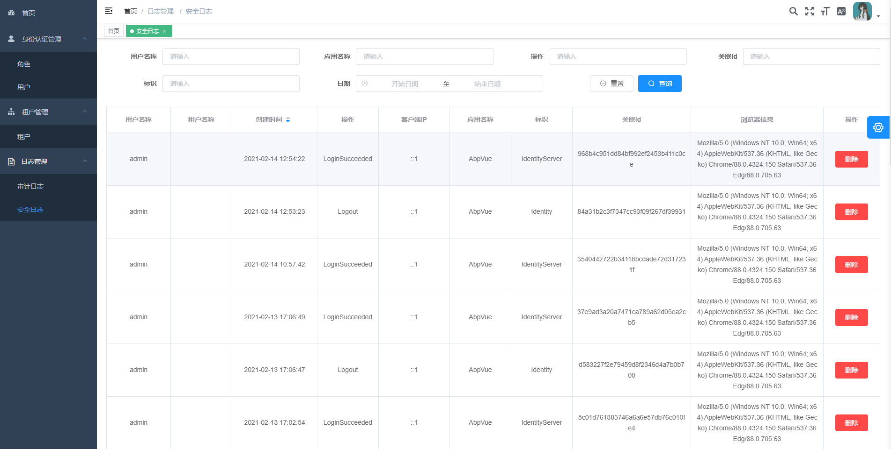
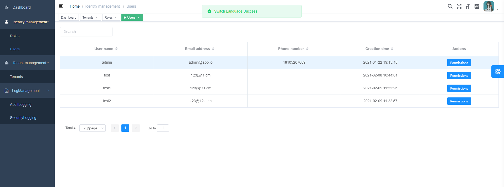

# 基于abp vnext vue的一个测试项目，开发中，逐步完善至，官网提供的demo功能

# 安装初始化
### 后端项目 生成，执行AbpVue.DbMigrator自动迁移数据库
### 前端项目 最好用yarn代替npm, 安装依赖yarn install

# 功能截图
## 登录

## 功能概览

## 个人中心

## 角色权限

## 用户权限

## 审计日志

## 安全日志

## 多语言

